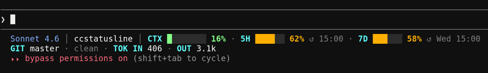

# ccstatusline — Claude Code Enhanced Statusline

A two-line statusline for Claude Code showing context window usage, rate-limit bars, git status, token counts, and active task — all color-coded by severity.

## What it shows

**Line 1:** `ModelName │ [active task] │ dirname │ CTX ████░░░░ nn% · 5H ████░░ nn% ↺HH:MM · 7D ████░░ nn%`

**Line 2:** `GIT branch · ~n · ↑n · TOK IN nn.nk · OUT nn.nk`

- **CTX** — context window usage (normalized to the usable range, hitting 100% at autocompact threshold)
- **5H / 7D** — claude.ai subscription rate-limit bars with reset times (hidden when not applicable)
- **GIT** — branch name, dirty file count, unpushed commit count
- **TOK** — cumulative session input/output token counts
- **Active task** — current in-progress todo from Claude Code's task list (bold amber)
- **GSD badge** — `⬆ /gsd:update` shown when a GSD plugin update is available

Color ramp on all bars: green → amber → orange → red → blinking red (at 92%+)



---

## Requirements

- [Node.js](https://nodejs.org/) (any modern version — uses only built-in modules)
- [Claude Code CLI](https://claude.ai/code)

---

## Installation

### macOS / Linux

#### One-line install (recommended)

```bash
curl -fsSL https://raw.githubusercontent.com/bradsec/ccstatusline/main/install.sh | bash
```

Or with `wget`:

```bash
wget -qO- https://raw.githubusercontent.com/bradsec/ccstatusline/main/install.sh | bash
```

This will:
1. Create `~/.claude/hooks/` if it doesn't exist
2. Download `statusline-enhanced.js` into that directory
3. Make it executable
4. Print the `settings.json` snippet to add

#### Manual install

```bash
mkdir -p ~/.claude/hooks
curl -fsSL https://raw.githubusercontent.com/bradsec/ccstatusline/main/hooks/statusline-enhanced.js \
  -o ~/.claude/hooks/statusline-enhanced.js
chmod +x ~/.claude/hooks/statusline-enhanced.js
```

---

### Windows

Open **PowerShell** (run as your normal user — no admin required):

```powershell
# Create hooks directory
New-Item -ItemType Directory -Force -Path "$HOME\.claude\hooks" | Out-Null

# Download the statusline script
Invoke-WebRequest -Uri "https://raw.githubusercontent.com/bradsec/ccstatusline/main/hooks/statusline-enhanced.js" `
  -OutFile "$HOME\.claude\hooks\statusline-enhanced.js"

Write-Host "Installed to $HOME\.claude\hooks\statusline-enhanced.js"
```

---

## Configuration

After installing, add (or merge) the following into your `settings.json`:

| Platform | Settings file location |
|----------|----------------------|
| macOS / Linux | `~/.claude/settings.json` |
| Windows | `%USERPROFILE%\.claude\settings.json` |

### macOS / Linux

```json
{
  "statusLine": {
    "type": "command",
    "command": "node \"/home/YOUR_USERNAME/.claude/hooks/statusline-enhanced.js\""
  }
}
```

Replace `YOUR_USERNAME` with your actual username. The `~` shorthand does **not** work in the `command` string — use the full absolute path.

To get the correct path automatically, run:

```bash
echo "node \"$(echo ~/.claude/hooks/statusline-enhanced.js)\""
```

### Windows

```json
{
  "statusLine": {
    "type": "command",
    "command": "node \"C:\\Users\\YOUR_USERNAME\\.claude\\hooks\\statusline-enhanced.js\""
  }
}
```

Replace `YOUR_USERNAME` with your Windows username. To get the correct escaped path, run in PowerShell:

```powershell
"node `"$($HOME -replace '\\','\\')\.claude\hooks\statusline-enhanced.js`""
```

---

## Updating

### macOS / Linux — one-line update

Pull the latest version directly from the repo:

```bash
curl -fsSL https://raw.githubusercontent.com/bradsec/ccstatusline/main/hooks/statusline-enhanced.js \
  -o ~/.claude/hooks/statusline-enhanced.js && echo "ccstatusline updated."
```

Or with `wget`:

```bash
wget -qO ~/.claude/hooks/statusline-enhanced.js \
  https://raw.githubusercontent.com/bradsec/ccstatusline/main/hooks/statusline-enhanced.js \
  && echo "ccstatusline updated."
```

### Windows — PowerShell update

```powershell
Invoke-WebRequest -Uri "https://raw.githubusercontent.com/bradsec/ccstatusline/main/hooks/statusline-enhanced.js" `
  -OutFile "$HOME\.claude\hooks\statusline-enhanced.js"
Write-Host "ccstatusline updated."
```

After updating, restart Claude Code to pick up the changes.

---

## Restart Claude Code

Close and reopen Claude Code (or start a new session) after any install or update to pick up the new statusline.

---

## Files

```
hooks/
  statusline-enhanced.js   — the statusline script
install.sh                 — macOS/Linux installer
settings-snippet.json      — the settings.json fragment to add
README.md                  — this file
```

> **Tip:** If you use the [GSD plugin](https://github.com/steiner-labs/get-shit-done), the statusline will automatically show an update badge when a new version is available. No extra configuration needed.
